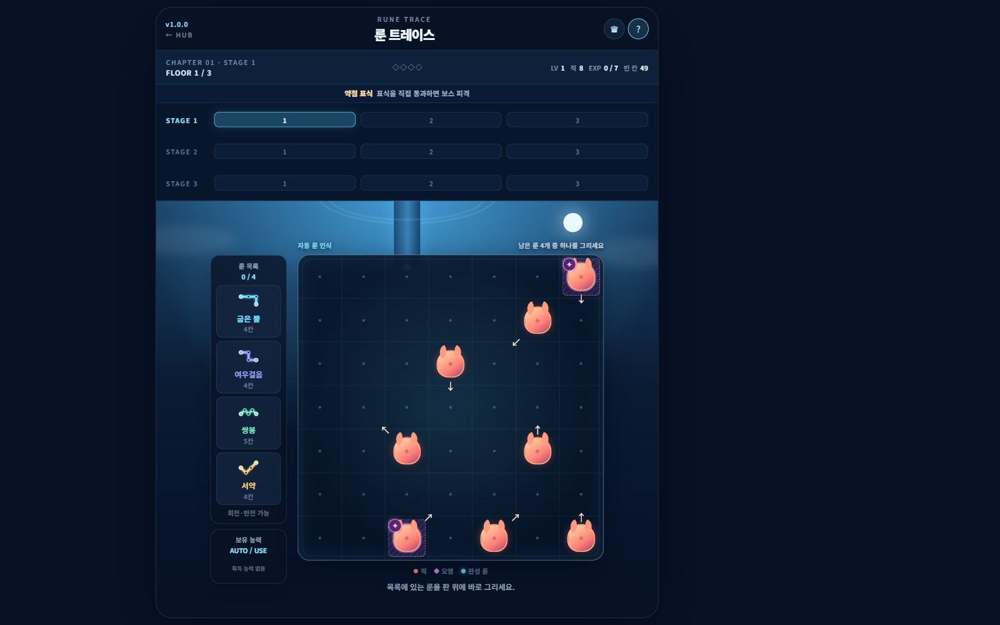
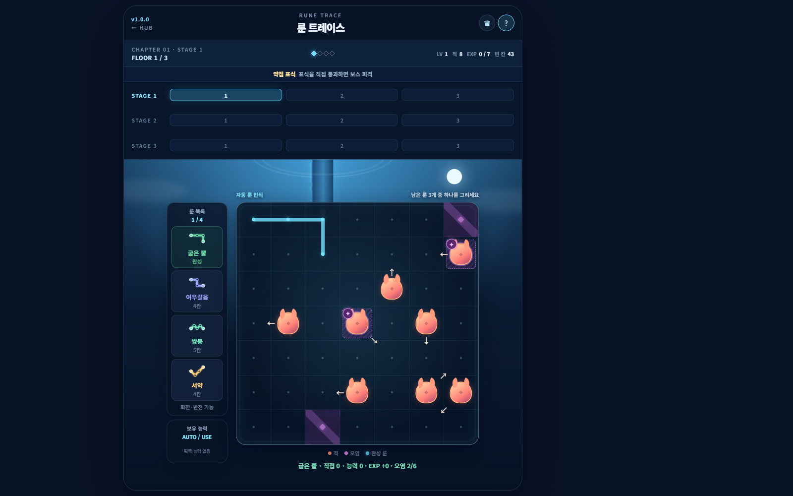
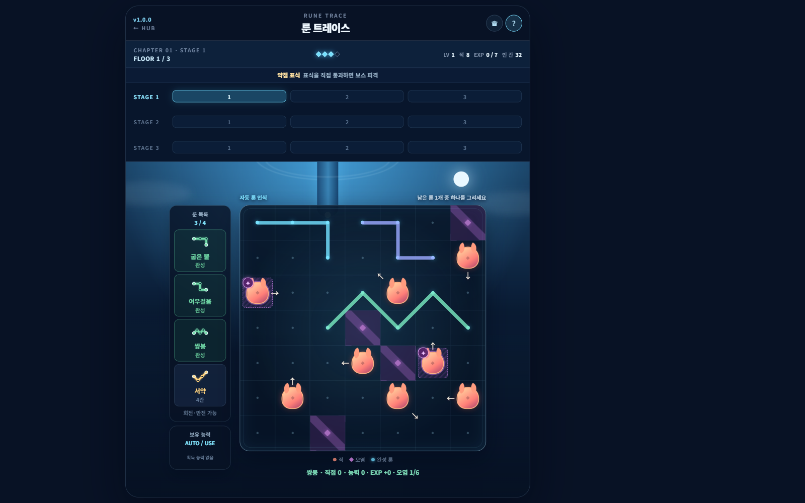
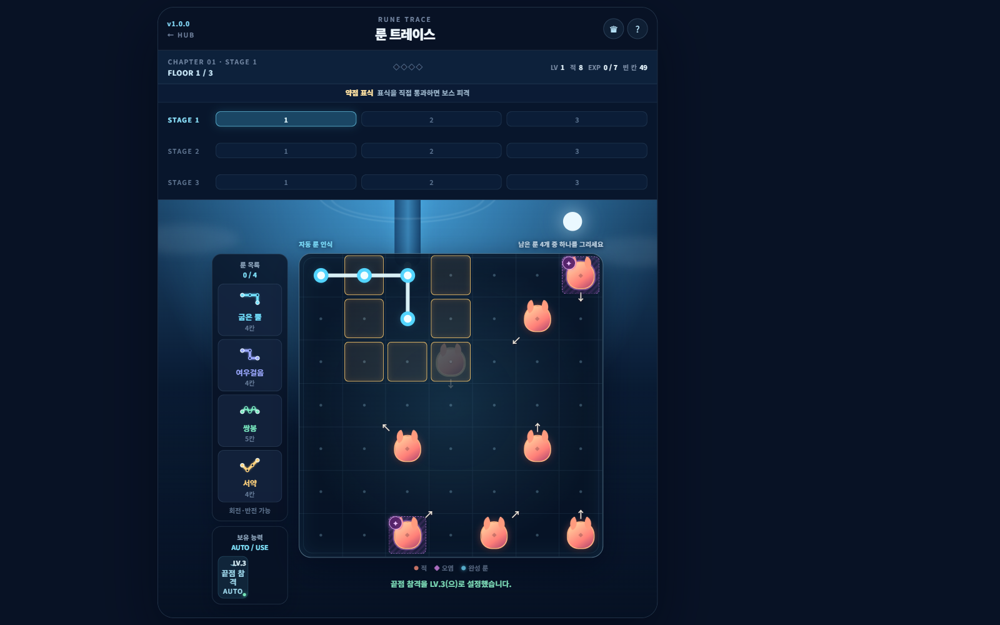
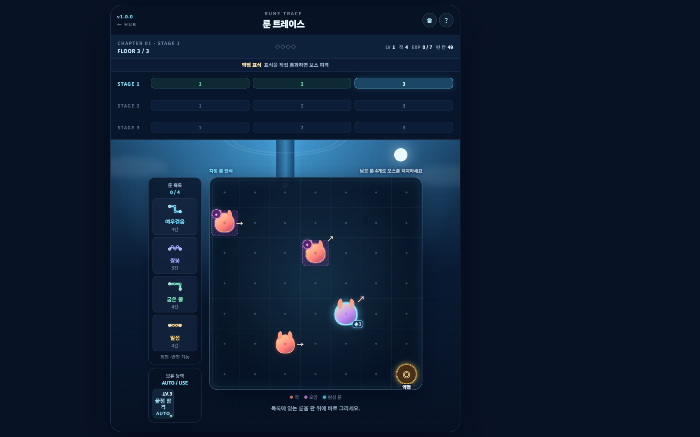

# 룬 트레이스 · 슈퍼센트 게임 제출본

> 적을 많이 잡으면 오히려 다음 룬을 놓지 못할 수 있다.

- 장르: 하이브리드 퍼즐 로그라이크
- 플랫폼: 모바일 우선, 현재 웹 프로토타입
- 현재 버전: Web Prototype v1.0.0
- 핵심 입력: 보드에 룬 경로 직접 그리기
- 목표 플레이: 스테이지 5~10분
- 기준 문서: [창작 기획서 마스터 수정 제안본](./2026-07-28_룬-트레이스-창작-기획서-마스터-수정제안본.md)
- [프로토타입 실행](https://asstro1456.github.io/Prototype_Casual_Rogue/rune-trace/index.html)
- 시연 영상: 편집 후 링크 삽입

이 문서는 슈퍼센트의 게임 퍼블리싱 검토를 위한 제안본입니다. 코어 훅, 광고 소재와 실제 플레이의 일치, 시장 테스트 계획, 확장 가능한 콘텐츠 구조를 우선합니다.

- 제출 기준 참고: [Supercent Publishing](https://supercent.io/publishing)
- 게임 제출: [Supercent Game Submission](https://supercent.typeform.com/to/PkkPrQAm)

| 상태 | 의미 |
|---|---|
| 구현 완료 | Web Prototype v1.0.0에서 확인 가능 |
| 확정 기획 | 코어 규칙으로 유지 |
| 검증 가설 | 시장 테스트와 지표 확인 필요 |
| 제품화 계획 | 퍼블리싱 협업 범위에서 검토 |

---

# 1. 검토 요약

## 한 줄 소개

> 네 개의 룬을 직접 그려 적을 처치하고, 다음 룬을 놓을 공간까지 관리하는 모바일 퍼즐

## 첫 화면에서 전달되는 행동

1. 제시된 룬을 확인합니다.
2. 보드에서 같은 형태의 경로를 직접 그립니다.
3. 경로 위 몬스터가 처치됩니다.
4. 경로는 흔적으로 남아 다음 행동의 공간을 줄입니다.

## 하이브리드 확장

- 직접 입력과 연속 처치로 캐주얼 후킹을 만듭니다.
- 흔적·오염·이동 예측으로 퍼즐 판단을 만듭니다.
- 능력 선택과 보스 관문으로 한 챕터의 성장 동기를 만듭니다.
- 룬·몬스터·능력·보스 규칙을 조합해 콘텐츠를 확장합니다.

## 현재 확인이 필요한 핵심 가설

- 직접 그리는 입력이 광고와 첫 플레이에서 즉시 이해되는가
- 처치와 공간 보존의 충돌이 불편이 아니라 재도전 동기가 되는가
- 능력 선택이 짧은 세션의 반복을 늘리는가
- 코어 행동을 유지한 채 광고·도구·외형 상품을 결합할 수 있는가

---

# 2. 코어 훅과 플레이

## 코어 규칙

> 완성한 룬은 흔적으로 남아 공간을 차지하고, 남은 룬을 놓을 수 없으면 실패한다.

룬 형태와 이동·오염 예정 확인  
↓  
배치 위치 탐색  
↓  
룬 직접 입력  
↓  
공격·능력 처리  
↓  
몬스터 이동·오염  
↓  
다음 룬 공간 판단  
↓  
클리어 또는 실패

## 한 행동의 두 결과

| 현재 이득 | 미래 비용 |
|---|---|
| 경로 위 적 처치 | 완성 경로가 흔적으로 남음 |
| 직접 처치 EXP 획득 | 다음 룬 배치 공간 감소 |
| 능력 발동 조건 충족 | 몬스터 이동·오염 발생 |

## 판정

- 일반 플로어는 일반 몬스터 전멸 또는 룬 네 개 완성 시 클리어합니다.
- 보스 플로어는 네 번째 룬 행동까지 보스를 처치해야 합니다.
- 남은 룬을 하나도 놓을 수 없으면 공간 부족으로 실패합니다.
- 잘못된 입력은 행동으로 소비하지 않습니다.

---

# 3. 광고 소재와 실제 플레이

## 원칙

> 광고에서 본 행동을 첫 플레이에서도 바로 수행하게 한다.

광고용 가짜 선택을 만들지 않습니다. 실제 프로토타입의 룬 입력, 처치, 흔적, 공간 부족 실패를 소재로 사용합니다.

## 소재 A. 많이 잡으면 실패

많은 적을 처리하는 경로를 먼저 보여줍니다. 마지막 룬을 놓지 못해 실패한 뒤, 적게 잡더라도 공간을 남기는 경로로 성공합니다.

### 확인

- 첫 1초 안에 실패 원인이 보이는가
- `많이 잡기`와 `공간 남기기`의 대비가 클릭 동기로 작동하는가
- 광고 후 첫 플레이에서 같은 상황을 경험하는가

## 소재 B. 같은 룬, 다른 결과

같은 룬을 서로 다른 위치에 배치합니다. 처치 수, 남은 공간, 몬스터 이동 결과가 달라지는 모습을 비교합니다.

### 확인

- 직접 입력 자체가 시각적 훅이 되는가
- 정답 하나가 아닌 비교 선택으로 보이는가

## 소재 C. 네 개의 룬 도전

처음부터 보드와 네 개의 룬을 함께 보여주고 모두 배치할 수 있는지 질문합니다.

### 확인

- 규칙 설명 없이 도전 구조가 전달되는가
- 실패 후 다른 배치를 시도하고 싶은가

## 초기 크리에이티브 테스트

| 소재 | 첫 장면 | 핵심 지표 |
|---|---|---|
| 많이 잡으면 실패 | 연속 처치 후 공간 부족 | CTR, 설치 전환, 첫 플로어 진입 |
| 같은 룬, 다른 결과 | 좌우 배치 비교 | 설치 전환, 첫 룬 입력 |
| 네 개의 룬 도전 | 보드와 룬 4개 동시 노출 | CTR, 첫 룬 입력 |

---

# 4. 세션과 성장

## 플레이 단위

| 단위 | 구성 | 목표 시간 | 역할 |
|---|---:|---:|---|
| 플로어 | 룬 최대 4회 | 1~3분 | 하나의 보드 문제 |
| 스테이지 | 3개 플로어 | 5~10분 | 성장과 보스 관문 |
| 챕터 | 3개 스테이지 | 15~30분 | 하나의 빌드 완성 |

초기 초행 로그에서는 실제 시간이 목표보다 짧았습니다. 플로어 수를 늘리기보다 몬스터 배치와 룬 조합의 판단 밀도를 먼저 조정합니다.

## 성장 루프

직접 처치 EXP  
↓  
레벨업 능력 선택  
↓  
경로·처치 방식 변화  
↓  
스테이지 보스  
↓  
다음 스테이지  
↓  
챕터 보스  
↓  
레벨·EXP·능력 초기화

## 능력

| 계열 | 능력 | 만드는 변화 |
|---|---|---|
| 전투 | 유혹 | 이동 예정 칸을 막아 룬 충돌 유도 |
| 전투 | 도탄 | 다수 직접 처치 후 가까운 대상 추가 공격 |
| 전투 | 끝점 참격 | 룬 끝점을 추가 공격 범위로 사용 |
| 퍼즐 | 오염 무시 | 오염 칸 1개 통과 |
| 퍼즐 | 룬 연결 | 이전 흔적 제거와 공간 재구성 |
| 퍼즐 | 룬 교체 | 남은 룬 형태 변경 |

능력은 처치 수만 늘리지 않습니다. 좋은 경로의 기준과 후반 공간 운용을 바꿉니다.

---

# 5. 레벨·콘텐츠 생산 구조

## 조합 단위

룬 세트  
↓  
몬스터 구성과 이동  
↓  
오염 조건  
↓  
능력 풀  
↓  
보스 변형  
↓  
플로어 목표와 특수 규칙

## 레벨 디자인 변수

| 변수 | 바뀌는 판단 |
|---|---|
| 룬 형태·순서 | 배치 가능 위치와 남길 공간 |
| 몬스터 수·위치 | 직접 처치 우선순위 |
| 이동 예약 | 충돌 능력과 다음 턴 위험 |
| 오염 대상·상한 | 후반 공간 압박 |
| 능력 후보 | 빌드 방향 |
| 보스 변형 | 공략 목표와 필요 타격 |

## 제작 우선순위

1. 기존 조합으로 난도 곡선을 확보합니다.
2. 신규 룬보다 몬스터·보스 규칙으로 판단을 확장합니다.
3. 새 요소는 기존 보드에서 다른 선택을 만들 때만 추가합니다.
4. 해결 가능성과 모바일 가독성을 자동 QA와 플레이 로그로 확인합니다.

## 보스

각 스테이지 마지막 플로어에 이동형 보스를 배치합니다.

- 스테이지 1: 약점 표식
- 스테이지 2: 수호 연결
- 스테이지 3: 피격 후 증원 소환
- 예약 이동 칸을 룬으로 막으면 돌진 충돌 피해
- 완전히 갇히면 주변 장애물을 제거하고 탈출

---

# 6. 첫 플레이와 UX

## 첫 1분

추천 룬 경로 확인  
↓  
직접 입력  
↓  
경로 위 몬스터 처치  
↓  
흔적 생성 확인  
↓  
두 번째 룬에서 다른 위치 비교  
↓  
이동·오염 확인

긴 설명보다 첫 플로어 안에서 규칙을 경험하게 합니다.

## 정보 우선순위

1. 처치 예정
2. 이동 화살표
3. 오염 예정

## 공정성

- 이동과 오염 예정은 행동 전에 공개합니다.
- 입력 중 결과를 다시 추첨하지 않습니다.
- 미리보기와 실제 처리 순서를 일치시킵니다.
- 실패 이유를 보드와 결과 화면에서 설명합니다.
- 도구나 결제 없이 해결할 수 없는 정상 보드를 만들지 않습니다.

---

# 7. 시장 테스트와 데이터

## 검증 순서

### 1단계. 크리에이티브

- 소재별 CTR
- 설치 전환
- 광고 행동과 첫 플레이 일치

### 2단계. 코어 조작

- 첫 행동 시간
- 첫 룬 입력 성공률
- 잘못된 입력
- 첫 플로어 진입·클리어

### 3단계. 게임 구조

- 플로어 첫 시도 클리어
- 공간 부족과 보스 생존 실패
- 실패 후 재시도
- 능력 선택 분포
- 스테이지 시간 P50·P90

### 4단계. 유지와 수익화

- D1·D7
- 챕터 중단 후 복귀
- 보상형 광고 선택·완료
- 도구 사용 후 같은 시도 클리어
- 결제 제안 후 이탈과 불공정 응답

상업 지표는 코어 조작과 초기 유지가 확인된 뒤 판단합니다.

## 현재 로그

- 세션과 복귀
- 스테이지·플로어 시작과 종료
- 룬 선택·경로 결과
- 직접·능력 처치
- 보스 변형·피격
- 실패·재시도·저장 복원

---

# 8. 초기 외부 플레이테스트

본인과 QA 반복 기록을 제외한 초행 사용자 3명의 v1.0.0 로그입니다. 표본이 작으므로 시장성 결론이 아니라 진행 가능성과 측정 구조 확인에 사용합니다.

| 항목 | 결과 | 판단 |
|---|---:|---|
| 첫 플로어 클리어 | 3/3 | 초행 사용자의 첫 플로어 진행 가능성 |
| 챕터 완료 | 2/3 | 나머지 1명은 플로어 8 진입 |
| 플로어 종료 판정 | 36회 | v1.0.0 기록 |
| 클리어 | 35회 · 97.2% | 현재 난도가 낮을 가능성 |
| 실패 | 1회 · 2.8% | 실패 사례 추가 필요 |
| 재시도 상태 완료 | 4회 | 모두 클리어 |
| 플로어 경과 시간 | 평균 약 37초 · 중앙값 약 31초 | 목표보다 짧음 |
| 완주자 챕터 활동 시간 | 약 7.2분 · 14.3분 | 목표보다 짧은 사례 |

플로어 경과 시간은 진행 중 모달·대기를 포함하고 결과 모달을 제외합니다. 현재 구현에서는 탭 비활성 시간도 포함될 수 있습니다.

## 다음 테스트

- 초행 사용자 5~10명
- 소재별 설치 후 첫 행동 비교
- 오염량·몬스터 수·룬 조합별 플로어 시간
- 능력 선택 편중
- 공간 부족 실패의 이해와 재시도

- [플레이 로그 Google Sheets](https://docs.google.com/spreadsheets/d/1cT2RzvHeshUi4AH6FRBEj8OukQe_oxl3z4xbOvQwdGM/edit)

---

# 9. 수익화 가설

## 원칙

- 기본 게임에 불편을 만든 뒤 해결책을 판매하지 않습니다.
- 핵심 공간 퍼즐을 결제로 제거하지 않습니다.
- 보상은 플레이 흐름을 끊지 않는 시점에 선택적으로 제안합니다.

## 보상형 광고

- 런 종료 후 아웃게임 재화 추가
- 능력 후보 1회 교체
- 도구 무료 획득
- 일일 도전 추가 입장

실패 직전 부활은 우선순위를 낮춥니다. 공간 관리 실패를 광고로 지우면 코어 규칙의 의미가 약해집니다.

## 인앱 구매

- 광고 제거
- 탐색 렌즈·교차 인장·정화 도구 묶음
- 보드·룬 선·이펙트·UI 외형
- 챕터 배경 테마

능력 영구 적용, 챕터 스킵, 룬 배치 횟수 추가는 제외합니다.

---

# 10. 퍼블리싱 협업 제안

## 현재 제공 가능

- 플레이 가능한 Web Prototype v1.0.0
- 1챕터·3스테이지·9플로어
- 룬 6종, 능력 6종
- 이동형 보스와 변형 3종
- 저장·복원
- 플레이 로그와 QA 패널
- 광고 소재 가설 3종

## 협업이 필요한 영역

### 시장 테스트

- 크리에이티브 제작과 국가·채널별 테스트
- CPI·CTR·초기 행동 데이터 확보
- 경쟁작과 타깃 포지셔닝 검토

### 제품화

- 모바일 UI와 터치 입력
- Android 테스트 빌드
- 아트·애니메이션·사운드
- 광고·분석 연동
- 메타·LiveOps·수익화 구조

### 소프트런치

- 코어 난도와 세션 시간
- D1·D7과 광고 지표
- 콘텐츠 생산 속도
- 도구와 외형 상품의 불공정 인식

## 제안하는 진행

시장 소재 3종 테스트  
↓  
첫 행동과 설치 전환 확인  
↓  
모바일 프로토타입 전환  
↓  
소규모 초행·리텐션 테스트  
↓  
소프트런치  
↓  
지표 기반 난도·수익화 조정

---

# 11. 제작 범위와 담당

| 구분 | 기간 | 주요 작업 |
|---|---|---|
| 초안 기획 | 2026.07.24~2026.07.25 | 직접 입력, 흔적, 공간 부족 실패 |
| 프로토타입 제작 | 2026.07.24~2026.07.28 | 능력·보스·저장·QA·로그 |
| 문서 구체화 | 2026.07.27~2026.07.29 | 규칙, 시장 근거, 테스트 결과 |

- 핵심 개발·기획 1인이 프로토타입과 규칙을 담당했습니다.
- AI는 구현과 반복 수정의 보조 도구로 사용했습니다.
- 요구사항, 우선순위, 예외, 검수와 통합은 직접 담당했습니다.
- 모바일 제품화 시 아트·사운드 협업이 필요합니다.

---

# 12. 주요 리스크

| 리스크 | 대응 | 확인 지표 |
|---|---|---|
| 룬 형상 학습 부담 | 첫 룬 가이드와 입력 보정 | 첫 입력 성공률 |
| 공간 관리 불쾌감 | 오염 상한과 예정 정보 | 실패 후 재시도 |
| 세션이 지나치게 짧음 | 판단 밀도와 몬스터 구성 조정 | 시간 P50·P90 |
| 능력 편중 | 선택률·클리어율 비교 | 능력별 선택·승률 |
| 반복 콘텐츠 부족 | 조합형 레벨 구조 | D1·D7 |
| 광고와 플레이 불일치 | 실제 코어 행동만 소재화 | 첫 플로어 진입 |
| 도구 의존 | 무료 해결 가능성 검증 | 도구 의존 클리어 비중 |

---

# 결론

룬 트레이스는 직접 그리는 단순한 첫 행동과, 흔적으로 인해 다음 수를 고민하는 공간 퍼즐을 결합했습니다. 현재 프로토타입은 코어 규칙과 측정 구조를 확인한 단계입니다.

퍼블리싱 검토에서는 다음 세 가지를 먼저 확인하고 싶습니다.

1. 직접 그리기와 공간 부족 실패가 크리에이티브 훅으로 작동하는가
2. 짧은 세션과 능력 빌드가 하이브리드 퍼즐의 초기 유지로 이어지는가
3. 조합형 콘텐츠 구조가 모바일 제품화 비용에 맞는가

---

# 부록. 현재 구현값

| 항목 | 값 | 상태 |
|---|---:|---|
| 보드 | 7×7 | 구현 |
| 플로어당 룬 | 최대 4개 | 구현 |
| 스테이지당 플로어 | 3개 | 구현 |
| 챕터당 스테이지 | 3개 | 구현 |
| 룬 기본형 | 6종 | 구현 |
| 능력 | 전투 3종·퍼즐 3종 | 구현 |
| 직접 처치 EXP | 1 | 구현 |
| 레벨업 요구치 | EXP 7 | 초기 테스트값 |
| 행동당 오염 대상 | 최대 2체 | 구현 |
| 플로어당 몬스터 오염 | 최대 6칸 | 구현 |
